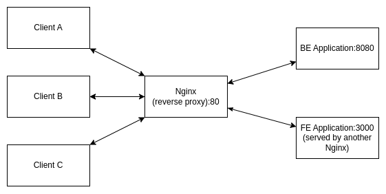

# Setup a Reverse Proxy

## Description

In this simple exercise, you are tasked to setup a reverse proxy, something like this:

Now you have been provided with two services:
- Backend API
    - Running on port `8080`
    - has this API endpoint:
        - `GET` /ping
- Frontend application
    - Running on port `3000`
    - This API needs to consume API from port `80`, from the endpoint `/api/ping`

## Task 1

We want to put these services behind a Nginx reverse proxy and exposes only port of `80`.

To access the frontend application, the user may use the path of `/`.
To access the backend application, the user may access the path of `/api`.

The rest of the services, other than the Nginx reverse proxy, shouldn't be accessible outside of the docker network.

## Task 2

In this current setup, the backend will log the incoming IP from the Nginx instead from the clients themselves. 
1. Setup your Nginx so that the IP address is also forwarded to the Backend API
1. Add the backend response to include the forwarded IP Address

Note: make sure to rebuild the backend service and reload the Nginx config to ensure the changes are reflected.